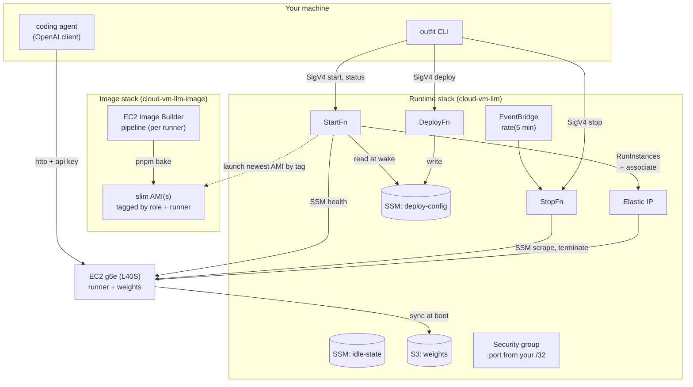
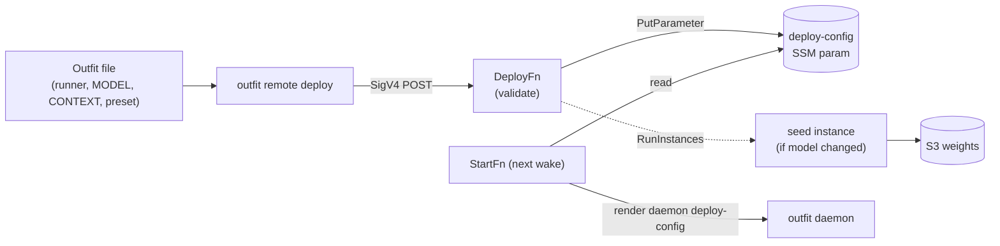
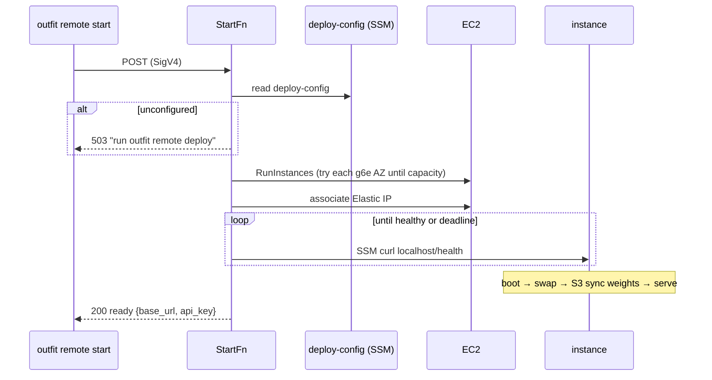
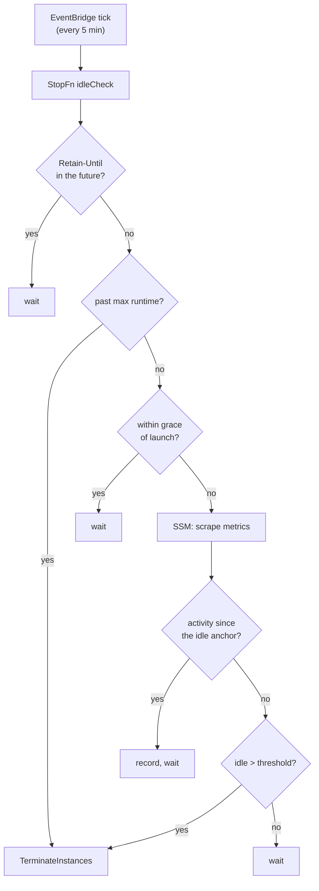

# Architecture

Maintainer-facing notes on how this deployment is put together. For *using* it, see
the [README](../README.md); for the pound-and-pence, [costs.md](costs.md).

## What it is

A **scale-to-zero, self-hosted OpenAI-compatible LLM endpoint** on AWS. A GPU
instance exists only while you are actually serving requests: a start Lambda
launches one on demand, and a stop Lambda terminates it after idle. Nothing runs
(and almost nothing is billed) at rest.

Three ideas hold it together:

- **The instance is stateless.** No fixed EC2 instance, no persistent EBS. The
  start Lambda launches one from a baked AMI, the stop Lambda terminates it. The
  model weights live in S3 and are synced onto the instance at boot.
- **The runner is pluggable.** The inference server (currently vLLM; llama.cpp
  landing) is chosen per deployment, not hard-wired. A runner-neutral
  *deploy-config* says what to serve; the start Lambda builds the right command.
- **Deployment config is data, not a redeploy.** What to serve (runner, model,
  context, serve args) lives in an SSM parameter written by a deploy Lambda, so
  switching model or runner is a parameter write — no `cdk deploy`.

## The pieces



The Lambdas live **outside the VPC** (no NAT cost) and reach the instance over
**SSM Run Command** — a `curl` to the on-instance **outfit daemon**'s
loopback control API (`127.0.0.1:4242`), which supervises the engine and
collects its metrics — so nothing is exposed beyond the vLLM port, and that
only to your `/32`. A stable **Elastic IP** is re-associated on each launch so
the base URL never changes.

## The deploy-config control plane

The seam between "what infra exists" (CDK's job, provisioned once) and "what to
serve" (per deployment). `outfit remote deploy` reads an Outfit file and POSTs a
DeployConfig to the deploy Lambda; the Lambda validates it and writes the
`/cloud-vm-llm/deploy-config` SSM parameter. The next wake reads it.



The DeployConfig contract (`lambda/shared/deploy-config.ts`):

```
{ runner: "vllm" | "llamacpp",   // required; no default
  modelId, quant, contextSize, servedModelName,
  serveArgs: string[] }          // runner-specific flags, pre-tokenised
```

`weightsPrefix` is **not** part of the wire contract — the Lambda derives it as
`models/<runner>/<modelId>[/<quant>]/` and stores it in the parameter, so callers
never encode the S3 layout (and a prefix sent in the body is ignored). If those
weights are not in the bucket, the Lambda launches the seed instance itself and
replies `{seeding: true, seedInstanceId}`; a wake before it finishes would sync
an incomplete prefix, so wait for it.

At boot, `buildInferenceUserData()` renders it into the on-instance outfit
daemon's own deploy config — the model as the synced local path, the bind
address and per-runner key delivery resolved into the serve args — and the
daemon builds the engine command from there (`vllm serve …` or
`llama-server …`). There is **no default runner**: an unset or invalid config
fails the wake loudly rather than guessing.

The parameter is **outfit/manual-owned**. CDK creates it with a constant
`unconfigured` placeholder — deliberately *not* the cfg-derived config — so a
later `cdk deploy` can never clobber what `outfit remote deploy` (or a manual
edit) put there. `pnpm deploy`'s seed step (`scripts/seed-deploy-config.mjs`)
writes a cfg-derived initial config over the placeholder *only* while it is still
unconfigured, and only when CDK knows the full serve config (vLLM); llama.cpp's
serve args come from an Outfit, so its config is left for `outfit remote deploy`
to set.

## Wake lifecycle

`outfit remote start` (or any POST to the start Function URL) blocks until the
server is answering, so the caller gets one "ready" with the base URL + key.



Boot user-data (built by the start Lambda from the deploy-config): log
`nvidia-smi`, add a swapfile, `aws s3 sync` the weights, fetch the API key, then
write the daemon's deploy config, start `outfit daemon` (loopback `:4242`), and
request the engine's first start over its control API. The health check hits
`/health` on the port — portable across runners.

## Idle / stop



A failed scrape counts as "no activity", so a wedged box is still terminated at
the threshold rather than burning GPU-hours. A `Retain-Until` instance tag (UTC
ISO-8601) overrides both the idle timer and the max-runtime cap; a manual
`outfit remote stop` still terminates immediately.

## Image stack

`cloud-vm-llm-image` defines an **Image Builder pipeline**, not an image — so
`cdk deploy` is instant and a bad bake can never fail the stack. `pnpm bake`
triggers a build out-of-band; each successful bake tags its AMI (role, and — as
the second runner lands — runner), and the start Lambda launches the **newest
AMI matching the tags**. A slim AMI carries only the driver + the runner
(vLLM as a `uv` venv; llama.cpp as a prebuilt CUDA `llama-server`) — no Docker.

## Key files

| Concern | File |
|---|---|
| Config + validation | `lib/config.ts` |
| Runtime stack (lambdas, EIP, S3, params) | `lib/llm-stack.ts` |
| Image Builder pipeline | `lib/image-stack.ts` |
| Deploy-config contract | `lambda/shared/deploy-config.ts` |
| Runner registry (one spec per runner: boot, weights, seed) | `lambda/runners/` |
| The on-instance daemon's API (SSM curl targets) | `lambda/shared/daemon.ts` |
| Wake / launch / user-data (`buildInferenceUserData`) | `lambda/start/index.ts` |
| Idle / manual stop | `lambda/stop/index.ts`, `lambda/shared/idle.ts` |
| Set the deploy-config | `lambda/deploy/index.ts` |
| Shared AWS + SSM helpers | `lambda/shared/aws.ts` |
| Seed weights to S3 | `scripts/seed-model.mjs` |
| Seed the initial deploy-config (once, over the placeholder) | `scripts/seed-deploy-config.mjs` |
